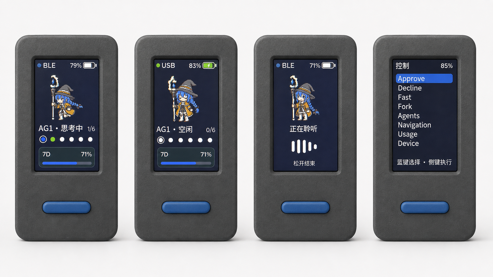

# MicroStick

MicroStick v1.0 将 M5Stack StickS3 变成一台面向 ChatGPT Desktop 的非官方 Codex Micro 兼容控制器。按键与六个 Agent 槽位通过 BLE Vendor HID 直接通信，StickS3 内置麦克风通过 USB UAC 提供给 macOS。唯一的 Mac 后台组件 `MicroStickUsageSync` 只负责把本机 Codex session 中的 7D 剩余用量通过加密 BLE GATT 同步到设备。

> MicroStick 是独立的开源兼容实现，与 OpenAI 或 Work Louder 无附属、授权或背书关系。Codex Micro 协议未公开，ChatGPT Desktop 更新可能影响兼容性。

[English](README.en.md)



## 功能

- Codex Micro 兼容 BLE HID：Mic、Send、Approve、Decline、Fast、Fork、Agent 1–6 与四个导航动作。
- ChatGPT Desktop 下发的六槽颜色、亮度、效果与状态，显示为 `AG1–AG6`、状态点和 Roxy 动画。
- 48 kHz、16-bit、单声道 `MicroStick Microphone` USB 输入设备。
- 本地电池、充电、BLE/USB 状态、Roxy 动画、提示音与 7D 用量。
- 7D 用量缓存于 Mac 私有目录和 StickS3 NVS；过期快照保留显示但会灰显。
- Apple Silicon 与 macOS 14+；硬件仅支持 M5Stack StickS3。

运行时不监听网络端口、不上传录音、不调用云端 ASR、不注入文本，也不要求辅助功能权限。语音识别、转写和 Codex 输入全部由 ChatGPT Desktop 完成。

## 按键

主页：

| 操作 | 功能 |
| --- | --- |
| 蓝键短按 | 等待 250 ms 双击窗口后发送 Send |
| 蓝键双击 | 设备自身发送两组 Escape 键，向当前前台 ChatGPT 请求取消；这不是 Micro 原生动作 |
| 蓝键按住 250 ms | 发送 Mic press；松开时发送 Mic release |
| 侧键短按 | 切换到下一个已分配 Agent |
| 侧键按住 500 ms | 打开控制中心 |

控制中心项目顺序为 `Approve / Decline / Fast / Fork / Agents / Navigation / Usage / Device`。蓝键短按选择下一项、蓝键长按选择上一项、侧键短按执行、侧键长按返回。Decline 会先进入确认页；再次按侧键确认，按蓝键或等待超时会取消。菜单 8 秒无操作后自动返回主页。

`Navigation` 使用默认 Micro 布局的 Plan、Back、Forward、Sidebar 摇杆方向。使用前请在 ChatGPT → Settings → Codex Micro 中恢复默认布局；自定义重映射后，屏幕标签可能与宿主动作不一致。

## 安装

GitHub Release 提供两个独立文件：

- `MicroStick-StickS3.bin`：已合并 bootloader、分区表和应用的固件镜像。
- `MicroStickUsageSync-v1.0.0-macos-arm64.zip`：已签名并公证的 Apple Silicon 后台组件。

1. 让 StickS3 进入 ROM 下载模式，将 `MicroStick-StickS3.bin` 写入偏移 `0x0`。烧录完成后按一次电源/复位键启动。
2. 在 macOS 蓝牙设置中配对 `Codex Micro`。如果设备曾使用不同 HID 描述符，请先忽略旧记录再重新配对。
3. 解压 UsageSync ZIP，在终端运行 `./install.sh`。如系统要求，在“系统设置 → 通用 → 登录项”中启用 `MicroStickUsageSync`，并允许蓝牙访问。
4. 在 ChatGPT 的 Codex Micro 设置中恢复默认布局；如需使用 StickS3 麦克风，在 ChatGPT 中选择 `MicroStick Microphone`。

无需 StickS3 USB 麦克风时可以拔掉 USB；BLE 控制仍可使用，ChatGPT 会继续使用当前选择的 Mac 麦克风。

诊断：

```bash
./doctor.sh
```

卸载：

```bash
./uninstall.sh
./uninstall.sh --purge
```

默认卸载保留用量缓存；`--purge` 同时移除 `~/Library/Application Support/MicroStick`。

## 从源码构建

要求 Apple Silicon Mac、macOS 14+、Swift 5.9+ 与 ESP-IDF 5.5.2。

```bash
swift test --package-path app/macos
./script/build_usage_sync.sh --debug

export IDF_PATH=/path/to/esp-idf-v5.5.2
./script/build_firmware_release.sh
```

普通安装不会下载 ESP-IDF；只有开发者从源码构建固件时需要工具链。常用入口见 `./scripts/dev.sh --help`。

## 安全与隐私

- UsageSync 只读取 `~/.codex/sessions` 中 `token_count.rate_limits` 所需字段，不保存或输出对话正文。
- 用量写入要求已绑定且加密的 BLE 连接，并使用 write-with-response、分片长度校验与 CRC。
- 不读取浏览器 Cookie、ChatGPT Token 或账户凭据；不请求远程额度 API；不发送遥测。
- 固件的 Escape 取消回退会作用于前台应用，应只在 ChatGPT 位于前台时使用。

协议、架构、硬件和验收细节见 [docs](docs/)。许可证见 [LICENSE](LICENSE)，第三方声明见 [NOTICE](NOTICE)。
